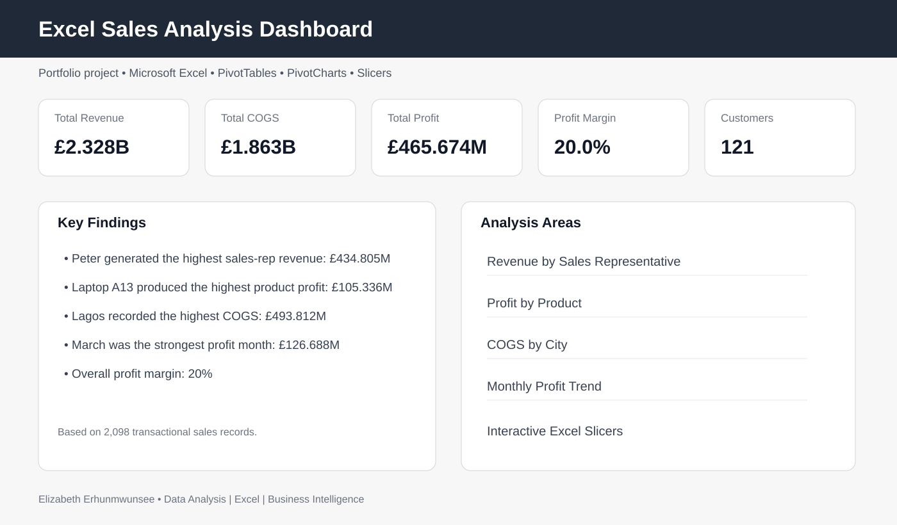

# Excel Sales Analysis Dashboard

An interactive **Microsoft Excel sales analysis project** developed to transform transactional sales data into a clear, decision-focused dashboard.

## Project Overview

This project analyses **2,098 sales records** across products, sales representatives, cities, regions, customer types and sales channels. The workbook combines structured sales data, analytical summaries and an interactive dashboard to make business performance easier to understand.

The dashboard focuses on five core questions:

- How much revenue, cost and profit did the business generate?
- Which products contributed the most profit?
- Which sales representatives generated the most revenue?
- How did cost of goods sold vary by city?
- How did profit change month by month?

## Key Performance Indicators

| KPI | Result |
|---|---:|
| Total Revenue | **£2.328B** |
| Total COGS | **£1.863B** |
| Total Profit | **£465.674M** |
| Profit Margin | **20.0%** |
| Number of Customers | **121** |

## Key Insights

- **Peter** generated the highest revenue among the sales representatives shown, at approximately **£434.805M**.
- **Laptop A13** generated the highest profit among the products shown in the product analysis, at approximately **£105.336M**.
- **Lagos** recorded the highest COGS among the cities analysed, at approximately **£493.812M**.
- **March** was the strongest profit month, generating approximately **£126.688M**.
- Overall profitability remained strong, with a **20% profit margin**.

## Dashboard Components

The dashboard includes:

- KPI cards for revenue, COGS, profit, customer count and profit margin
- Product profitability analysis
- Revenue by sales representative
- COGS by city
- Monthly profit trend
- Interactive Excel slicers for exploring the data

## Workbook Structure

### `Sales Data`
Contains the underlying transactional dataset, including:

- Date
- Sales representative
- Product and category
- Quantity
- Unit price and cost price
- Customer type
- Region and city
- Sales channel
- Revenue
- COGS
- Profit

### `Analysis`
Contains the KPI summaries and PivotTable outputs used to support the dashboard.

### `Dashboard`
Presents the final interactive business dashboard using PivotCharts, KPI cards and slicers.

## Tools & Skills Demonstrated

- Microsoft Excel
- Data cleaning and preparation
- Excel Tables
- PivotTables
- PivotCharts
- Slicers
- KPI development
- Business data analysis
- Dashboard design
- Data visualisation
- Insight communication

## Files

- [`Excel_Sales_Analysis_Dashboard.xlsx`](Excel_Sales_Analysis_Dashboard.xlsx) — complete interactive Excel workbook
- [`analysis-summary.csv`](analysis-summary.csv) — concise KPI and insight summary
- [`assets/dashboard-preview.svg`](assets/dashboard-preview.svg) — portfolio dashboard preview

## About This Project

This project was completed as part of my practical data analytics development with **TS Academy**. It demonstrates my ability to take a raw sales dataset through analysis and present the results in an accessible dashboard designed for business decision-making.

---

**Author:** Elizabeth Erhunmwunsee  
**Portfolio focus:** Data Analysis | Excel | Business Intelligence
