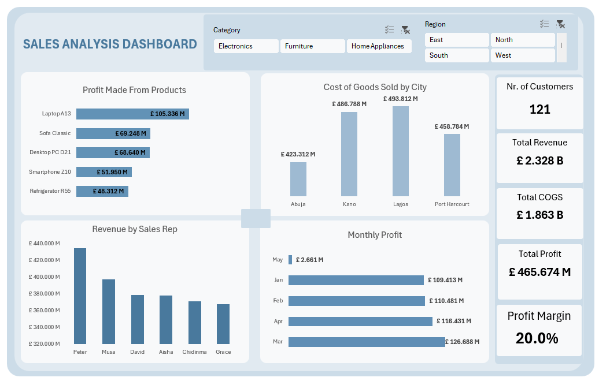

# Excel Sales Analysis Dashboard

> **Portfolio Stage 3 — Professional Reporting | KPI Analysis | Business Intelligence | Microsoft Excel**

This project reflects a more developed stage of my Excel analytics work. Building on earlier projects, I focused not only on the analysis itself but also on how results are structured, documented and communicated for a business audience.

The workbook converts **2,098 transactional sales records** into an interactive dashboard for monitoring revenue, cost, profit, product performance, sales-representative performance, geographic cost patterns and monthly trends.

## Executive Summary

| KPI | Result |
|---|---:|
| Total Revenue | **£2.328B** |
| Total COGS | **£1.863B** |
| Total Profit | **£465.674M** |
| Profit Margin | **20.0%** |
| Customer Count | **121** |

### Key Findings

- **Peter** generated the highest revenue among the sales representatives shown: **£434.805M**.
- **Laptop A13** generated the highest profit among the products shown: **£105.336M**.
- **Lagos** recorded the highest COGS among the cities analysed: **£493.812M**.
- **March** produced the highest monthly profit: **£126.688M**.
- Overall profit margin was **20%**.

## Business Questions

The dashboard was designed to answer:

1. What are total revenue, COGS and profit?
2. What is the overall profit margin?
3. Which products contribute the most profit?
4. Which sales representatives generate the most revenue?
5. How does COGS vary by city?
6. How does profit change over time?

## Analytical Approach

**Transactional data → structured analysis → KPI development → PivotTables → PivotCharts → interactive dashboard → business insights**

The workbook separates the source data, analysis layer and reporting layer so the logic behind the dashboard can be reviewed rather than treating the final visual as a standalone output.

For more detail, see **[Project Methodology](docs/METHODOLOGY.md)**.

## Dataset

The source table contains **2,098 records** across fields covering:

- transaction date
- sales representative
- product and category
- quantity
- unit price and cost price
- customer type
- region and city
- sales channel
- revenue
- COGS
- profit
- month index and month label

See the **[Data Dictionary](docs/DATA_DICTIONARY.md)** for field definitions.

## Workbook Structure

### `Sales Data`
Contains the underlying transactional records.

### `Analysis`
Contains KPI summaries and PivotTable outputs for:

- Product by Profit
- Sales Representative by Revenue
- City by COGS
- Profit by Month

### `Dashboard`
Presents the final interactive reporting view using KPI cards, charts and slicers.

## Skills Demonstrated

- Microsoft Excel
- Data preparation and structuring
- Excel Tables
- PivotTables
- PivotCharts
- Slicers
- KPI development
- Business performance analysis
- Dashboard design
- Data visualisation
- Insight communication
- Project documentation

## Project Files

| File | Purpose |
|---|---|
| **[Excel_Sales_Analysis_Dashboard.xlsx](Excel_Sales_Analysis_Dashboard.xlsx)** | Complete interactive Excel workbook |
| **[analysis-summary.csv](analysis-summary.csv)** | Headline KPI and insight summary |
| **[Dashboard Screenshot](assets/dashboard-preview.png.png)** | Original dashboard screenshot |
| **[METHODOLOGY.md](docs/METHODOLOGY.md)** | Analytical workflow and business questions |
| **[DATA_DICTIONARY.md](docs/DATA_DICTIONARY.md)** | Field definitions and core measures |

## How to Explore the Project

1. Open **[Excel_Sales_Analysis_Dashboard.xlsx](Excel_Sales_Analysis_Dashboard.xlsx)**.
2. Start with the **Dashboard** sheet for the visual overview.
3. Use the slicers to explore different views.
4. Review the **Analysis** sheet to see the supporting PivotTables.
5. Review **Sales Data** to understand the underlying records.

## Portfolio Progression

This project builds on my earlier Excel portfolio work in two important ways.

First, the analysis is framed more deliberately around business questions and headline KPIs. Second, the repository itself is documented more professionally, with a methodology, data dictionary, summary outputs and clear guidance for reviewing the workbook.

It represents my progression from learning Excel tools individually to using them as part of a structured reporting workflow.

## Development Direction

My portfolio is intentionally progressive. After establishing a strong Excel foundation, I am continuing to build deeper capability across **SQL, Power BI, Python/R and AI-enabled automation**, with each future project designed to introduce new analytical or technical skills rather than repeat the same workflow.

---

**Aisosa Elizabeth Erhunmwunsee**  
*Pharmacy | Business Analytics | Data Analysis | Business Intelligence*
